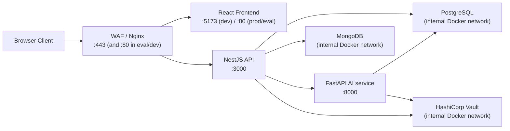

# ADR-001: Dual-Backend Microservices Architecture

**Status:** Accepted
**Deciders:** agaga, ji-hong

---

## Context

The project requires two fundamentally different types of workloads:

1. **Business logic** — authentication (JWT, 2FA, OAuth2), user management, friends, chat, wishlists, reviews, notifications. These are I/O-bound, latency-sensitive, and benefit from a strongly typed, decorator-driven framework.
2. **AI/ML workloads** — sentence embedding inference, vector similarity search, sentiment classification. These are CPU/memory-bound, require Python's ML ecosystem (sentence-transformers, Hugging Face), and should be independently scalable and replaceable.

Running both in a single process would mean: deploying a new sentiment model forces redeployment of the entire auth system, and vice versa.

---

## Decision

Split the backend into two independent services:

| Service | Framework | Responsibility |
|---|---|---|
| `backend-nest` | NestJS (Node.js) | API gateway, auth, user logic, chat, social features |
| `backend-python` | FastAPI (Python) | Semantic search, recommendations, sentiment analysis |

The NestJS service calls the Python service over the internal Docker network. The frontend never calls the Python service directly.

---

## Architecture

---

## Consequences

### Positive
- ML models can be updated, replaced, or scaled without touching the NestJS service
- Python's ML ecosystem (PyTorch, Hugging Face, sentence-transformers) is used where it belongs
- Each service has a clear single responsibility
- Independent Docker build contexts and resource limits

### Negative
- Adds network hop latency for search requests (NestJS → FastAPI)
- Two separate deployment units to maintain, monitor, and version
- Cross-service debugging is harder than in-process calls

---

## Alternatives Considered

| Option | Why rejected |
|---|---|
| Single NestJS service with JS ML libs (`tensorflow.js`, `onnxruntime-node`) | Limited model support, worse performance, no Hugging Face ecosystem |
| Single Python service for everything | Would replace NestJS's mature auth/social features with a less ergonomic stack |
| gRPC between services | Overkill for current load; plain HTTP over internal Docker network is sufficient |