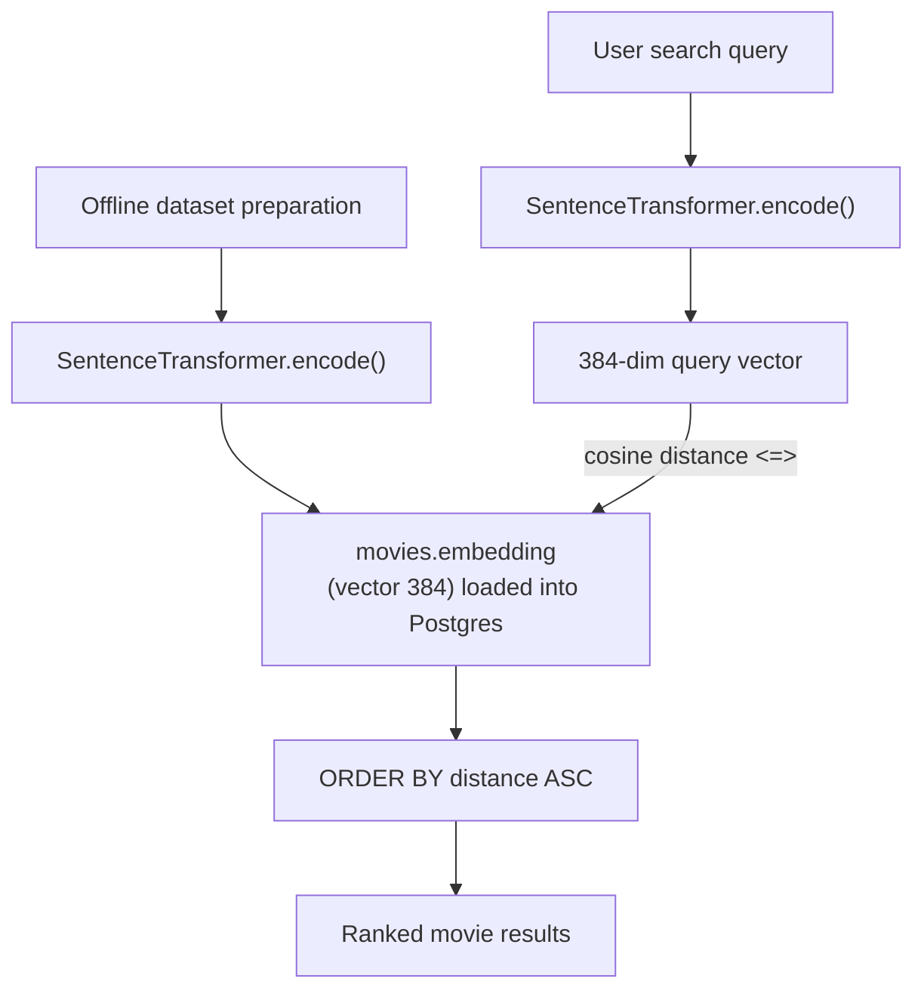

# ADR-002: Vector Similarity Search with pgvector

**Status:** Accepted  
**Date:** 2026
**Deciders:** agaga  

---

## Context

Traditional keyword search (ILIKE, full-text search) fails for the core use case: a user typing *"fedex manager got lost on an tiny island "* expects to find *Cast away* even if none of those exact words appear in the movie's description.

The project needed a search mechanism that operates on **meaning**, not exact text match.

---

## Decision

Use **pgvector**, a PostgreSQL extension, to store and query 384-dimensional sentence embeddings. In the current implementation, movie embeddings are precomputed during dataset preparation and loaded into PostgreSQL (`movies.embedding`). At query time, the search text is embedded with `sentence-transformers` and compared to stored vectors using **cosine distance**.

This keeps the entire vector store inside the existing PostgreSQL instance — no separate vector database (Pinecone, Qdrant, Weaviate) is needed.

---

## How It Works

### Title Boost

During ranking (not as a post-processing step), a small title boost is applied by reducing cosine distance when the query text matches the movie title exactly or partially. This helps exact/partial title matches rank above semantically close but title-irrelevant results.

---

## Embedding Model

| Property | Value |
|---|---|
| Library | `sentence-transformers` |
| Dimensionality | 384 |
| Distance metric | Cosine distance (`<=>` in pgvector) |
| Runtime | Loaded once at FastAPI startup, reused across requests |

---

## Consequences

### Positive
- No separate vector database infrastructure to operate
- Semantic queries work regardless of exact word overlap
- pgvector `ivfflat` / `hnsw` indexes can be added later for sub-millisecond ANN at scale
- User search embeddings are also stored (`user_search_actions.embedding`) enabling semantic recommendation history

### Negative
- 384-dim vector per movie row increases storage; acceptable at current scale (20k movies)
- Cold-start: embedding model takes several seconds to load at container startup
- Cosine distance scans require a sequential scan without an ANN index; tolerable until > ~100k rows

---

## Alternatives Considered

| Option | Why rejected |
|---|---|
| PostgreSQL full-text search (`tsvector`) | Keyword-only, no semantic understanding |
| Elasticsearch / OpenSearch | Additional infrastructure; overkill for this scale |
| Pinecone / Qdrant (dedicated vector DB) | Extra service to operate; pgvector is sufficient for this scale |
| Larger embedding model (e.g., `all-mpnet-base-v2`, 768-dim) | Higher compute at query time; 384-dim `all-MiniLM-L6-v2` is a proven speed/quality tradeoff |