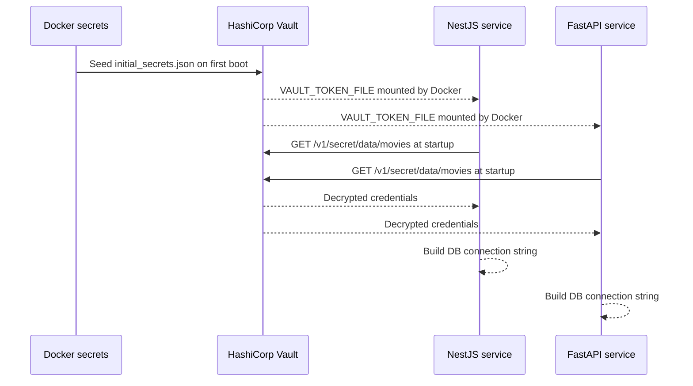

# ADR-003: Centralized Secret Management with HashiCorp Vault

**Status:** Accepted  
**Date:** 2025  
**Deciders:** agaga, ji-hong  

---

## Context

The project handles a large number of secrets: database passwords (PostgreSQL, MongoDB), JWT signing keys, OAuth client secrets (Google, GitHub), TMDB API key, Hugging Face token, R2 storage credentials, and SMTP credentials.

Storing secrets in `.env` files risks accidental leaks through version control, Docker image layers, or shell history. Docker secrets (flat `.txt` files) solve the version control problem but do not support rotation, auditing, or fine-grained access control.

---

## Decision

Use **HashiCorp Vault** (running as a Docker container in the stack) as the primary source of truth for application secrets. Both `backend-nest` and `backend-python` authenticate to Vault at startup using a token file, and retrieve secrets before constructing database connection strings or API clients.

Docker secrets (`postgres_password.txt`, `mongo_password.txt`) are used by the database containers. Vault is seeded from `initial_secrets.json`. In the current implementation, `backend-python` can skip Vault lookup only when `VAULT_TOKEN_FILE` is missing; `backend-nest` requires Vault token configuration at startup.

---

## Secret Flow

---

## Configuration Variables

The Python service checks for `VAULT_TOKEN_FILE` at startup. If present, it reads credentials from Vault. If absent (for example, local dev without Vault), it falls back to direct environment variables.

The NestJS service expects `VAULT_TOKEN_FILE` to be present at startup and fails fast if it is missing.

| Variable | Purpose |
|---|---|
| `VAULT_ADDR` | Vault server address |
| `VAULT_TOKEN_FILE` | Path to token file mounted by Docker |
| `POSTGRES_USER`, `POSTGRES_PASSWORD`, `POSTGRES_DB` | Fallback if Vault is unavailable |

Note: the environment variable fallback in this ADR applies to `backend-python`. `backend-nest` does not currently implement a no-Vault fallback path.

---

## Consequences

### Positive
- Secrets are fetched at runtime from Vault instead of being hardcoded in application source code or images
- Centralized rotation point — update a secret in Vault without redeploying services
- Audit log of all secret reads
- Consistent secret access pattern across NestJS and FastAPI

### Negative
- Vault itself must be bootstrapped and its root token protected
- Adds startup latency (network round-trip to Vault before DB connection is established)
- Local development without Vault requires careful fallback path maintenance

---

## Alternatives Considered

| Option | Why rejected |
|---|---|
| `.env` files only | Secrets easily committed or leaked through image layers |
| Docker secrets only | No rotation, no audit, no fine-grained access policies |
| AWS Secrets Manager / GCP Secret Manager | Cloud-provider dependency; this project runs self-hosted |