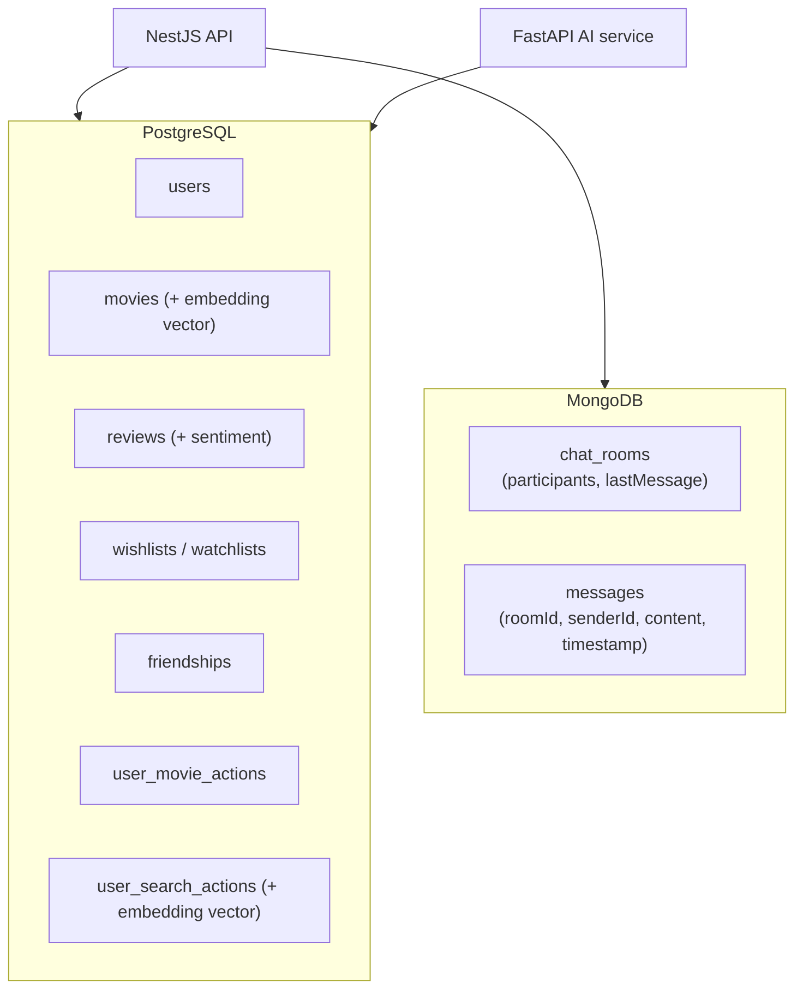

# ADR-004: Polyglot Persistence Strategy

**Status:** Accepted  
**Date:** 2025  
**Deciders:** agaga, erantala  

---

## Context

The application has two fundamentally different data access patterns:

1. **Relational / transactional** — users, movies, friendships, reviews, wishlists, watchlists, OAuth accounts, 2FA secrets. These have strong referential integrity requirements and benefit from ACID guarantees.
2. **Real-time messaging** — chat rooms and messages. These are high-frequency, low-latency writes with no complex join requirements. Messages are append-only and queried by `(roomId, timestamp)`. Flexible document structure allows quick iteration on message schema.

Forcing chat messages into PostgreSQL would add unnecessary write pressure to the primary relational store and complicate the schema with JSON columns or polymorphic tables.

---

## Decision

Use **two databases**:

| Database | Use case | ORM/Driver |
|---|---|---|
| PostgreSQL + pgvector | All relational data + AI embeddings | Prisma (NestJS), SQLModel/SQLAlchemy (FastAPI) |
| MongoDB | Chat rooms and messages | Mongoose (NestJS) |

---

## Data Distribution

---

## Consequences

### Positive
- Chat writes are isolated from the primary relational store — a message storm doesn't impact movie search latency
- MongoDB's flexible document model allows chat schema iteration without migrations
- PostgreSQL handles complex queries (joins, aggregations) for analytics and recommendations efficiently
- pgvector embeddings live in the same PostgreSQL instance as the movies they describe — no cross-DB join needed

### Negative
- Two database systems to operate, monitor, back up, and version
- No cross-database transactions (a user deletion requires coordinated writes to both stores)
- Developers must context-switch between Prisma (PostgreSQL) and Mongoose (MongoDB) within the same NestJS codebase

---

## Alternatives Considered

| Option | Why rejected |
|---|---|
| PostgreSQL only | Possible, but adds write pressure and JSONB complexity for high-frequency messages |
| MongoDB only | Relational integrity (friendships, reviews FK to users and movies) is painful without joins |
| Redis Pub/Sub for chat | Good for delivery, but not for persistence and history retrieval |