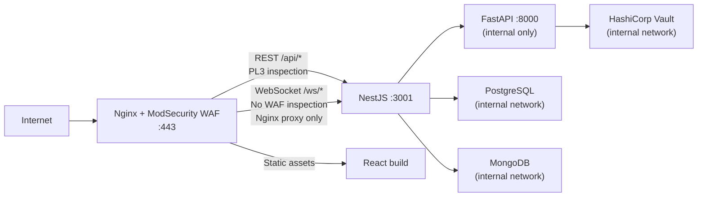

# ADR-005: Edge Security — ModSecurity WAF and Adaptive Nginx Routing

**Status:** Accepted  
**Date:** 2025  
**Deciders:** ji-hong, agaga  

---

## Context

The application is exposed to the public internet and handles sensitive operations: authentication, OAuth flows, file uploads, user-generated content (reviews), and an AI service. Without edge protection, these surfaces are vulnerable to SQL injection, XSS, path traversal, and other OWASP Top 10 exploits.

WebSocket connections (real-time chat) and REST API calls have different security characteristics. A single WAF configuration applied uniformly to both would either block legitimate WebSocket upgrades or leave API endpoints under-protected.

---

## Decision

Deploy **Nginx with ModSecurity (OWASP CRS)** as the single entry point for all traffic. Configure adaptive routing so that:

- REST API traffic (`/api/*`) passes through **ModSecurity at Paranoia Level 3** — aggressive rule enforcement
- WebSocket traffic (`/ws/*`, `/socket.io/*`) bypasses WAF rule inspection but is still proxied through Nginx — maintaining a single network entry point while avoiding false positives on WebSocket frames
- Static frontend assets are served directly by Nginx

Paranoia Level 3 was chosen over Level 4 to balance security coverage with false positive rate for a development/evaluation environment.

---

## Traffic Flow

---

## ModSecurity Configuration

| Parameter | Value | Reason |
|---|---|---|
| Ruleset | OWASP CRS | Industry standard, actively maintained |
| Paranoia Level | 3 | Aggressive without excessive false positives |
| Engine mode | `DetectionOnly` → `On` | Switched to enforcement after tuning |
| Anomaly scoring | Enabled | Blocks requests exceeding threshold score |

---

## Network Isolation

All backend services (`backend-nest`, `backend-python`, `postgres`, `mongodb`, `vault`) communicate over a **private Docker network**. Only Nginx is exposed on the host. The FastAPI service has no public port — it is only reachable from NestJS via the internal network.

---

## Consequences

### Positive
- Single network ingress point simplifies firewall rules and TLS termination
- OWASP CRS PL3 covers SQL injection, XSS, path traversal, protocol attacks out of the box
- WebSocket connections are not broken by ModSecurity false positives
- FastAPI AI service is completely shielded from direct internet access

### Negative
- PL3 may require custom rule exclusions for specific API payloads (e.g., JSON bodies with unusual characters)
- WAF bypass for WebSocket means WS messages are not inspected at the application-protocol level
- ModSecurity adds latency overhead on every REST request (~1-5ms per request for rule evaluation)

---

## Alternatives Considered

| Option | Why rejected |
|---|---|
| Cloudflare WAF | External dependency; project must run fully self-hosted |
| No WAF (Nginx only) | No application-layer inspection; insufficient for OWASP coverage |
| AWS WAF / Cloud WAF | Cloud-provider dependency |
| ModSecurity PL4 | Too aggressive; high false positive rate breaks normal API calls |