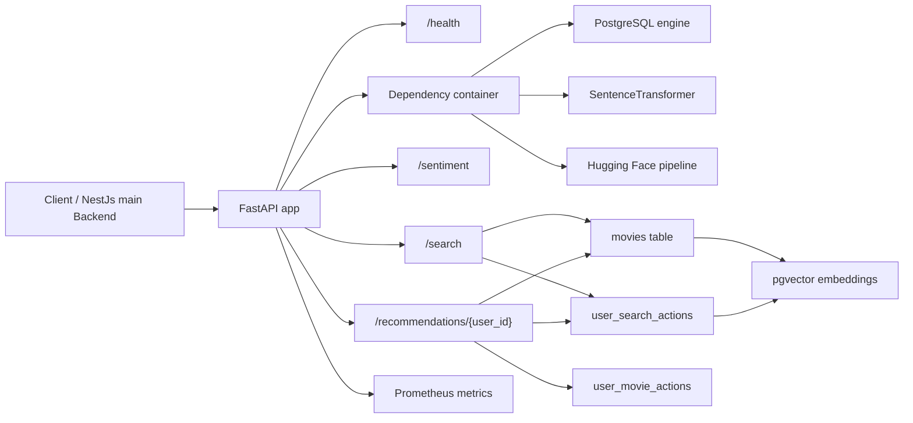
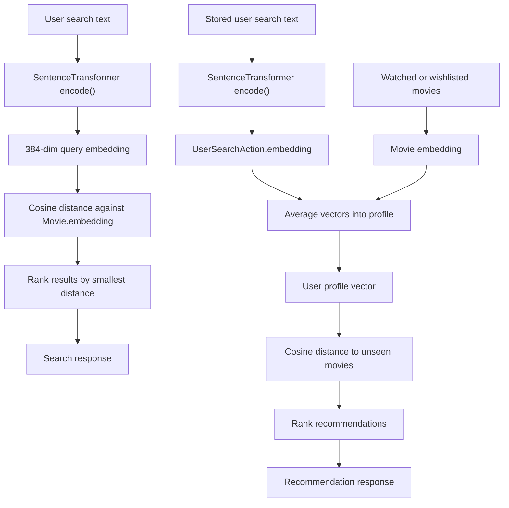

# backend-python

FastAPI service for the AI-heavy parts of the project. This service is responsible for semantic movie search, recommendation ranking, and sentiment analysis. It is intentionally separate from the NestJS API so the model-heavy work can be isolated, scaled, and updated independently.

## What this service does

The Python backend currently exposes three core features:

1. Semantic movie search
2. Personalized movie recommendations
3. Sentiment analysis for review text

It also exposes a health check and Prometheus metrics so the service can be monitored in the full stack.

## High-level architecture

At startup, the FastAPI application loads three main runtime resources:

- A PostgreSQL engine through SQLModel / SQLAlchemy
- A sentence embedding model from `sentence-transformers`
- A text classification pipeline for sentiment analysis

These are created once during application lifespan, stored in `app/api/dependencies.py`, and injected through FastAPI's dependency injection system. Request handlers then reuse those instances instead of reloading models for every request.

The startup flow is defined in [`app/main.py`](app/main.py).

### Architecture diagram



This diagram reflects the live runtime model in [`app/main.py`](app/main.py) and [`app/api/dependencies.py`](app/api/dependencies.py): the app loads the engine and models once, then reuses them through dependency injection.

## ML models

### Sentence embedding model

The search and recommendation features rely on a sentence embedding model loaded through `SentenceTransformer(settings.model_name)`.

This model turns natural language into a numeric vector that captures meaning rather than just keywords. Two texts that mean similar things should end up near each other in vector space even if they do not share the same exact words.

In practice, this is what makes queries like "a dark psychological thriller with a twist" useful for movie discovery.

### Sentiment model

Sentiment analysis uses a Hugging Face pipeline with the model `boltuix/NeuroFeel`.

The classifier returns a label and confidence score. The service treats low-confidence predictions as `neutral` so the result is less noisy for borderline text.

## How vectors work here

Vectors are the core of the semantic features in this service.

### What a vector is

A vector is just a list of numbers. For embeddings, each number represents part of the model's internal representation of meaning. This project uses 384-dimensional vectors.

That means every movie, user search, or query becomes something like:

```text
[0.012, -0.441, 0.893, ...]
```

Those values are not human-readable words. They are coordinates in a semantic space learned by the model.

### Why vectors are useful

Instead of comparing text by exact word matches, the service compares the meaning of one text against another.

For example:

- "space adventure with aliens"
- "sci-fi journey across the galaxy"

These may share few words, but their embeddings should still be close.

### How similarity is computed

The database stores embeddings in `pgvector` columns and compares them using cosine distance.

In simple terms:

- Similar vectors point in nearly the same direction
- Distant vectors represent different meanings
- Smaller cosine distance means a better match

The search service compares a query vector against `Movie.embedding`.
The recommendation service compares a blended user profile vector against unseen movies.

### Vector data flow



This is the main idea behind the semantic features:

- text is transformed into vectors
- vectors are stored in PostgreSQL with `pgvector`
- cosine distance is used to measure similarity
- smaller distance means a better semantic match

## Request flow

### 1. Search requests

When a client calls `/search?q=...`, the service:

- Encodes the query text into an embedding vector
- Optionally stores the user search event and its embedding when `userId` is provided
- Compares the query vector against movie vectors in PostgreSQL using `pgvector`
- Applies a small title boost when the query text matches the title exactly or partially
- Returns the nearest movies ordered by final similarity

The search logic lives in [`app/services/search_service.py`](app/services/search_service.py).

### 2. Recommendation requests

When a client calls `/recommendations/{user_id}`, the service:

- Loads the movies the user has already watched or wishlisted
- Loads the user's past search embeddings
- Blends those vectors into a single user profile vector by averaging them
- Finds unseen movies whose embeddings are closest to that profile vector

If the user has no usable history, the service falls back to popular highly-rated movies.

The recommendation logic lives in [`app/services/recommendation_service.py`](app/services/recommendation_service.py).

### 3. Sentiment requests

When a client calls `/sentiment`, the service:

- Truncates the submitted text to 512 characters
- Runs a Hugging Face text-classification pipeline
- Normalizes low-confidence outputs to `neutral`

The sentiment logic lives in [`app/services/sentiment_service.py`](app/services/sentiment_service.py).

## Database model

The Python service expects PostgreSQL with the `vector` extension enabled.

Relevant tables are defined in [`app/database/models.py`](app/database/models.py):

- `movies`
- `user_movie_actions`
- `user_search_actions`

### Important fields

- `movies.embedding`: 384-dimensional vector for movie semantics
- `user_search_actions.embedding`: 384-dimensional vector for past user queries
- `user_movie_actions`: stores watched and wishlisted actions for recommendation history

## Endpoint summary

### `GET /health`

Returns a simple service status response.

Example response:

```json
{
  "status": "running",
  "message": "Movie Search API is ready"
}
```

### `GET /search`

Query parameters:

- `q`: search text
- `page`: page number, starting at 1
- `size`: page size, up to 100
- `userId`: optional user id used to store the search event

Example response (shape):

```json
{
  "query": "dark thriller",
  "page": 1,
  "size": 5,
  "offset": 0,
  "results": [
    {
      "title": "...",
      "tmdb_id": 123,
      "similarity_score": 0.92
    }
  ]
}
```

### `POST /sentiment`

Body:

```json
{
  "text": "I loved the ending, but the pacing was slow."
}
```

Example response:

```json
{
  "label": "positive",
  "score": 0.9731
}
```

### `GET /recommendations/{user_id}`

Returns ranked movie recommendations for the given user.

Example response (shape):

```json
{
  "user_id": "user-uuid",
  "results": [
    {
      "title": "...",
      "tmdb_id": 456,
      "similarity_score": 0.88
    }
  ]
}
```

## Configuration

The service loads secrets through Vault when `VAULT_TOKEN_FILE` is present. It then builds the PostgreSQL connection string from environment variables.

### Required values

- `POSTGRES_USER`
- `POSTGRES_PASSWORD`
- `POSTGRES_DB`
- `MODEL_NAME`

### Optional values

- `VAULT_ADDR` (default: `http://vault:8200`)
- `VAULT_TOKEN_FILE` (if missing, Vault lookup is skipped)
- `HF_HOME`
- `TRANSFORMERS_CACHE`
- `HF_HUB_OFFLINE` (default behavior: false unless set to `1`)
- `TRANSFORMERS_OFFLINE` (default behavior: false unless set to `1`)

### Runtime defaults and notes

- Database host defaults to `postgres` in this service.
- Search query parameter `userId` is optional and only used for logging user search actions.
- If `VAULT_TOKEN_FILE` is not set, env vars must already be present in the runtime environment.

## Bootstrap / first-time setup

There is a bootstrap helper in [`app/database/init_db.py`](app/database/init_db.py) that can create the `vector` extension and create the `movies` table if missing.

Important: this helper is not called automatically during normal startup. The live startup path in [`app/main.py`](app/main.py) initializes the DB engine and ML models, but does not run database schema bootstrap.

For first-time environments, make sure the DB schema and `pgvector` extension are initialized through your migration/bootstrap process before serving traffic.

## Running the service

### With Docker

The repository already provides container orchestration at the project root. The Python backend is built from [`Dockerfile`](Dockerfile) and exposed on port `8000`.

### Locally

If you want to run it directly, the app entrypoint is:

```bash
uvicorn app.main:app --host 0.0.0.0 --port 8000
```

## Observability

Prometheus instrumentation is enabled through `prometheus-fastapi-instrumentator`, and metrics are exposed on the app without being included in the OpenAPI schema.

## Notes

- The vector-based features depend on PostgreSQL with the `pgvector` extension.
- The search and recommendation flows both depend on 384-dimensional embeddings.
