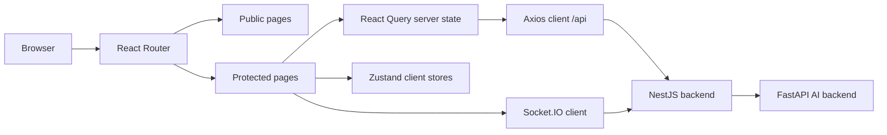

# frontend

Client application for moviesearchdb, built with React, TypeScript, and Vite.

This service provides the full user experience for authentication, semantic movie discovery, recommendations, social features, reviews, and real-time chat. It talks to the NestJS backend over HTTP and Socket.IO through the WAF/reverse proxy.

## What this frontend does

The frontend is responsible for:

1. Routing and page composition for public and authenticated areas
2. Authentication UX (login, register, OAuth callback, 2FA flow)
3. Movie browsing (semantic search, trending, recommendations, details)
4. Social and profile interactions (friends, wishlist, watched list, user pages)
5. Real-time chat and notification UX
6. Client-side state orchestration (React Query + Zustand)

## Framework and tech stack

### Core framework

- React 19
- TypeScript
- Vite 7
- React Router 7

### Data and state

- Axios for HTTP requests
- TanStack React Query for server-state caching and mutations
- Zustand for lightweight client-state stores

### UI and forms

- Tailwind CSS v4
- Shadcn UI setup and Radix primitives
- Lucide icons
- React Hook Form + Zod validation
- Sonner toast notifications

### Real-time

- Socket.IO client for chat and live friend/presence updates

## Application architecture

The app is initialized in [src/main.tsx](src/main.tsx), where providers are mounted in this order:

1. Theme provider (`next-themes`)
2. React Query provider (`QueryClientProvider`)
3. Tooltip provider
4. Root app routes
5. Global toaster

Routing is declared in [src/App.tsx](src/App.tsx) with:

- lazy-loaded pages via `React.lazy`
- suspense fallback for page-level loading state
- top-level error boundary
- public and protected route partitions

### Frontend architecture diagram



## Routing model

Defined in [src/App.tsx](src/App.tsx):

- `/login`, `/register`, `/auth/callback`, `/2fa/verify` under `AuthLayout`
- `/home`, `/movie/:id`, policy pages under `AppLayout`
- authenticated pages behind `ProtectedRoute`

`ProtectedRoute` in [src/components/ProtectedRoute.tsx](src/components/ProtectedRoute.tsx) checks the logged-in user from Zustand and redirects guests to `/login`.

## State management strategy

This frontend uses two state layers with distinct responsibilities.

### 1. React Query for server state

Used for data coming from APIs:

- search, trending, recommendations
- user profile and updates
- friends and social actions
- reviews, wishlist, watched list
- chat room lists and room messages

The shared QueryClient is configured in [src/main.tsx](src/main.tsx) with default retry and stale-time behavior.

### 2. Zustand for app/session state

Used for lightweight local state that should not depend directly on server cache lifecycle.

Current stores include:

- [src/store/authStore.ts](src/store/authStore.ts)
  - persists auth-related UI session data
  - stores `user`, temporary 2FA token, and unread message flags
- [src/store/movieListsMirrorStore.ts](src/store/movieListsMirrorStore.ts)
  - local mirror for wishlist/watched ids per user
  - improves instant UI feedback for toggles
- [src/hooks/useNotificationStore.ts](src/hooks/useNotificationStore.ts)
  - app notification queue for realtime events

In short:

- React Query owns canonical remote data
- Zustand owns local UX/session state and optimistic mirrors

## API layer

The API client in [src/api/client.ts](src/api/client.ts) uses `baseURL = /api` and `withCredentials = true`, so JWT cookies are sent automatically.

### Token refresh flow

The Axios response interceptor handles `401` responses by:

1. queueing concurrent failed requests
2. making a single `/auth/refresh` request
3. replaying queued requests if refresh succeeds
4. clearing auth and redirecting to `/login` if refresh fails

This prevents refresh storms and race conditions when multiple requests fail at once.

### API modules

Key API files:

- [src/api/auth.ts](src/api/auth.ts)
- [src/api/search.ts](src/api/search.ts)
- [src/api/user.ts](src/api/user.ts)
- [src/api/friends.ts](src/api/friends.ts)
- [src/api/chat.ts](src/api/chat.ts)
- [src/api/twofa.ts](src/api/twofa.ts)

## Real-time behavior

Socket bootstrapping is centralized in [src/hooks/useSocket.ts](src/hooks/useSocket.ts) and activated by [src/components/layout/AppLayout.tsx](src/components/layout/AppLayout.tsx).

### What it listens for

- `friendStatus`
- `friendRequest`
- `receiveMessageNotification`
- `markAsRead`

### What it updates

- React Query friend cache invalidation and patching
- Zustand unread-message state
- in-app notification store
- user-facing toast notifications

## UI system and styling

Design tokens and theming are in [src/index.css](src/index.css):

- Tailwind v4 setup
- CSS variable tokens (light/dark)
- semantic color mapping (`background`, `card`, `primary`, etc.)
- reusable radius and utility primitives

Shadcn config is in [components.json](components.json), with aliases wired to `@` paths and Lucide as the icon set.

## File/folder structure

Top-level source areas:

- `src/pages` - route pages
- `src/components` - reusable UI and feature components
- `src/api` - HTTP service modules
- `src/hooks` - feature and data hooks
- `src/store` - Zustand stores
- `src/lib` - utilities and socket helpers
- `src/types` - shared TypeScript contracts

## Build and runtime

### Local development

From `frontend/`:

```bash
npm install
npm run dev
```

Vite runs on `0.0.0.0:5173` in dev mode.

### Production-style build

```bash
npm run build
npm run preview
```

Vite build config is in [vite.config.ts](vite.config.ts), including aliasing, vendor chunk split, and HMR settings.

### Docker modes

- Dev image: [Dockerfile.dev](Dockerfile.dev)
  - runs Vite dev server
- Eval image: [Dockerfile.eval](Dockerfile.eval)
  - builds static assets and serves with Nginx on `8080`
- Prod image: [Dockerfile.prod](Dockerfile.prod)
  - builds static assets and serves with Nginx on `80`

SPA Nginx configs:

- [nginx.spa-eval.conf](nginx.spa-eval.conf)
- [nginx.spa.conf](nginx.spa.conf)

## Configuration notes

- API requests are hardcoded to `/api` in the Axios client.
- The app relies on reverse proxy routing from `/api` and `/socket.io` to backend services.
- Cookie-based auth requires HTTPS and `withCredentials` support in browser/proxy setup.

## Key feature flows

### Auth flow

1. Login/register/OAuth in auth pages
2. Backend sets HTTP-only cookies
3. `useAuthStore` stores the current user object for route guards/UI
4. Axios interceptor refreshes session when needed

### Search and recommendations flow

1. User submits query on Home page
2. React Query runs search/trending/recommendation hooks
3. API module normalizes backend payload shape to frontend `Movie` shape
4. UI renders paginated/infinite results

### Wishlist/watched flow

1. Toggle mutation updates server via `/wish` or `/watched`
2. Local Zustand mirror updates immediately for UX responsiveness
3. React Query invalidates canonical list queries

## Troubleshooting

- If auth seems broken after inactivity, inspect `/auth/refresh` responses and cookie flags.
- If API calls fail in browser but not in backend logs, verify WAF/proxy routes for `/api`.
- If socket events do not arrive, confirm `/socket.io/` proxy upgrade headers and same-origin credentials.
- If protected pages redirect unexpectedly, verify persisted user state in `moviedb-auth` local storage entry.

## Notes

- This frontend assumes NestJS is the public API surface and does not call FastAPI directly.
- Server-state and client-state are intentionally split between React Query and Zustand.
- For backend internals, read [../backend-nest/README.md](../backend-nest/README.md) and [../backend-python/README.md](../backend-python/README.md).
